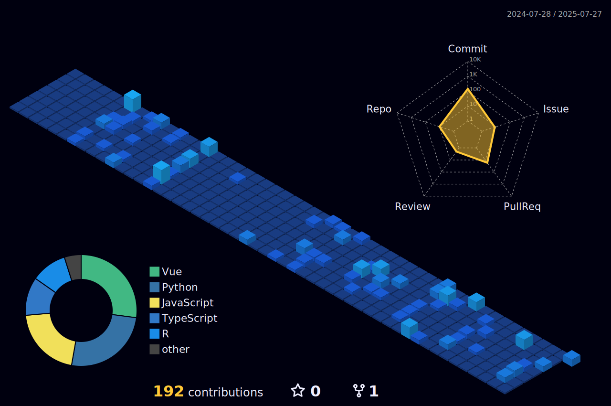

## Hi, I'm Nicholas! 👋

  

  
  
   

## 👨‍💻 About Me

I enjoy full-stack development, API integration, and working on projects that combine creativity with problem-solving. I'm currently exploring opportunities in software engineering, data engineering, and backend development.
- 🌱 Learning more about system design, artificial intelligence, and machine learning.
- 📫 Reach me at: nicholasdwnwong@gmail.com

## Tech Stack:

  
<table align="center">
  <tr>
    <td align="center">
      
    </td>
    <td align="center">
      
    </td>
  </tr>
  <tr>
    <td colspan="2" align="center">
      
    </td>
  </tr>
</table>

<!-- 
**NiWong03/NiWong03** is a ✨ _special_ ✨ repository because its `README.md` (this file) appears on your GitHub profile.

Here are some ideas to get you started:

- 🔭 I’m currently working on ...
- 🌱 I’m currently learning ...
- 👯 I’m looking to collaborate on ...
- 🤔 I’m looking for help with ...
- 💬 Ask me about ...
- 📫 How to reach me: ...
- 😄 Pronouns: ...
- ⚡ Fun fact: ...
-->
